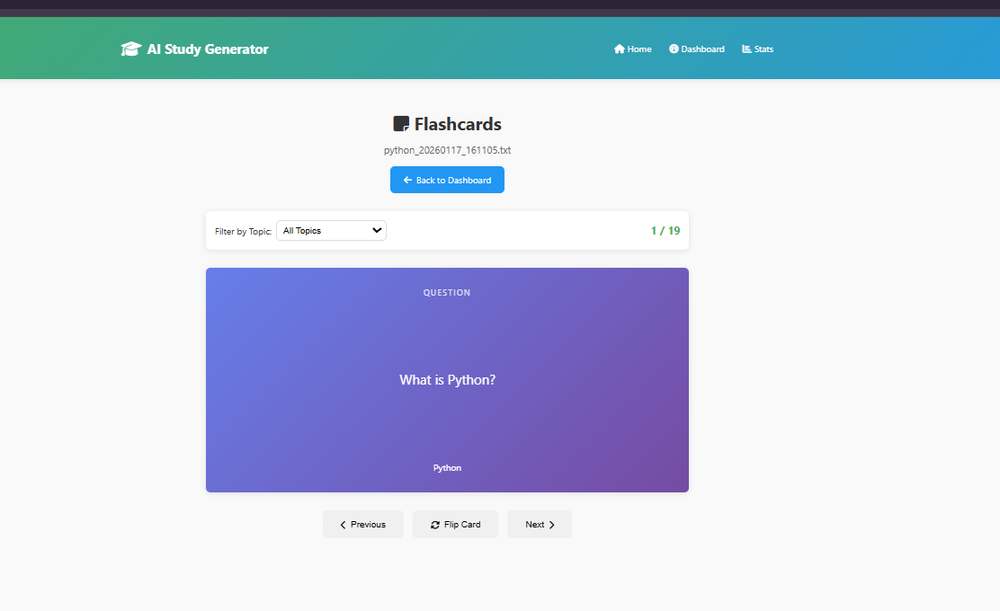
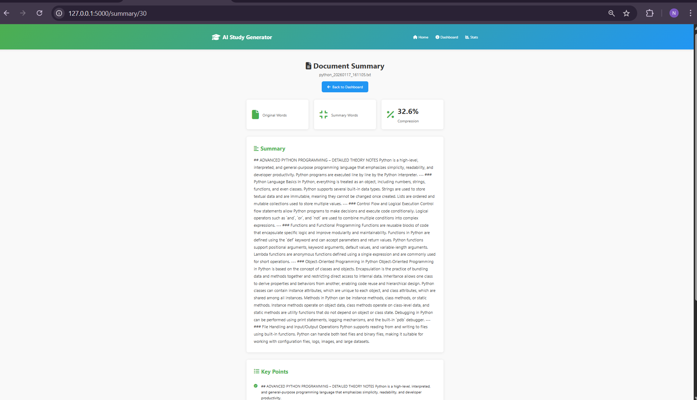
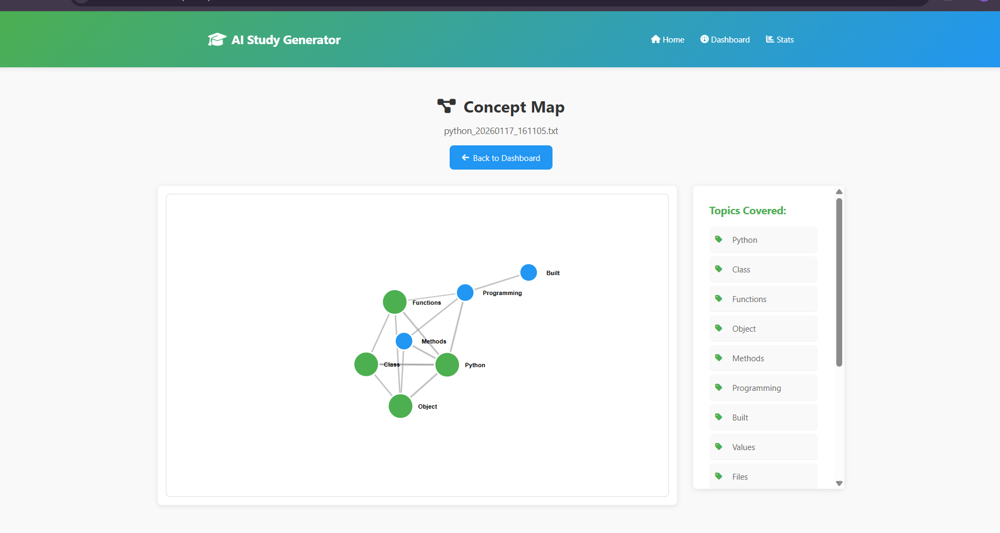

# AI Study Material Generator

## Challenge 6: Multi-Source Learning Content Ingestion & Structured Output Generation

### Objective

Build a tool that can take in study materials from different sources (PDFs, videos, documents, transcripts) and automatically create structured learning outputs like flashcards, summaries, concept maps, and learning paths.

---

## Functional Requirements

- **Parse multiple file types:** PDF, TXT, DOCX, MP4, AVI, MOV, MKV, WEBM
- **Extract key concepts & topic hierarchy:** Find important topics and organize them
- **Auto-generate structured educational outputs:** Flashcards, summaries, concept graphs, learning paths
- **Store and enable retrieval by topic:** Save all outputs and allow searching by topic

---

# AI Study Material Generator

## Challenge 6: Multi-Source Learning Content Ingestion & Structured Output Generation

### Objective

Build a tool that can take in study materials from different sources (PDFs, videos, documents, transcripts) and automatically create structured learning outputs like flashcards, summaries, concept maps, and learning paths.

---

## Application Screenshots

###  Interactive Flashcards

*Auto-generated Q&A flashcards with flip animations and topic filtering - Study with personalized questions and answers*

**Key Features:**
-  **Smart Question Generation** - "What is Python?" style questions from your content
-  **Topic-based Filtering** - Focus on specific subjects with dropdown menu
-  **Interactive Navigation** - Previous/Next buttons and keyboard shortcuts (Arrow keys, Spacebar)
- **Progress Tracking** - Shows current card position (1/19 format)
-  **Flip Animation** - Smooth 3D card flip to reveal answers

###  Document Summary Dashboard  

*Intelligent text summarization with compression analytics and key points extraction*

**Summary Features:**
-  **Compression Analytics** - Shows 32.6% compression ratio with visual statistics
-  **Statistics Dashboard** - Original vs summary word count comparison
-  **Key Points Extraction** - Bullet-pointed list of most important concepts
-  **Clean Interface** - Professional card-based layout with clear sections
- **Reading Time Estimation** - Optimized summary length for efficient studying

###  Interactive Concept Map

*D3.js powered interactive visualization showing topic relationships and connections*

**Concept Map Features:**
-  **Interactive Graph** - Drag-and-drop nodes with physics-based positioning
-  **Visual Relationships** - Connected lines showing how topics relate to each other
-  **Color-Coded Nodes** - Green circles (main topics) vs Blue circles (sub-topics)  
- **Topics Sidebar** - Complete list of covered topics with tag icons
-  **Responsive Design** - Works seamlessly on desktop and mobile devices
-  **Zoom & Pan** - Explore large concept networks with smooth interactions

---

##  What Makes This Special

### 1. **Complete End-to-End Solution**
Unlike basic converters, this provides a full learning ecosystem from upload to study.

### 2. **Advanced NLP Processing**  
Uses sophisticated algorithms to extract meaningful topics and relationships automatically.

### 3. **Interactive Visualizations**
Beautiful D3.js powered concept maps that help users understand complex relationships.

### 4. **Professional UI/UX**
Clean, modern interface that makes studying enjoyable and efficient.

### 5. **Multi-Format Support**
Handles PDFs, documents, and even video files with speech recognition.

## Deliverables

- **Web tool** for uploading and processing files
- **JSON/CSV flashcards** for easy sharing and import
- **Concept graph** and **learning path** visualizations

---

## Main Tools, Techniques, and Skills Used

- **Python 3** (main backend language)
- **Flask** (web framework)
- **NLTK** (natural language processing)
- **MoviePy, SpeechRecognition, pydub** (video/audio processing)
- **PyPDF2, python-docx** (file parsing)
- **D3.js** (concept map visualization)
- **HTML, CSS, JS** (frontend)
- **SQLite** (database)
- **Jinja2** (templating for web pages)
- **JSON, CSV** (output formats)

---

## How to Install & Run

1. **Clone the repository**
2. **Install dependencies:**  

'''
ai-study-material-generator/
│
├── 📁 src/                          # Main source code
│   ├── 📁 core/                     # Core functionality
│   │   ├── __init__.py
│   │   ├── file_parser.py          # PDF, DOCX, TXT parsing
│   │   ├── text_processor.py       # NLP, key concept extraction
│   │   ├── flashcard_generator.py  # Generate flashcards
│   │   ├── summary_generator.py    # Generate summaries
│   │   ├── concept_mapper.py       # Create concept graph
│   │   └── learning_path.py        # Generate learning path
│   │
│   ├── 📁 storage/                  # Database & file storage
│   │   ├── __init__.py
│   │   ├── database.py             # SQLite operations
│   │   └── file_manager.py         # Save/load JSON, CSV
│   │
│   ├── 📁 utils/                    # Helper functions
│   │   ├── __init__.py
│   │   ├── config.py               # Configuration settings
│   │   └── helpers.py              # Common utility functions
│   │
│   └── 📁 api/                      # Web API routes (Flask)
│       ├── __init__.py
│       ├── app.py                  # Main Flask app
│       └── routes.py               # API endpoints
│
├── 📁 static/                       # Frontend files (CSS, JS)
│   ├── 📁 css/
│   │   └── style.css               # Main stylesheet
│   ├── 📁 js/
│   │   ├── main.js                 # Main JavaScript
│   │   └── flashcard.js            # Flashcard functionality
│   └── 📁 images/
│       └── logo.png
│
├── 📁 templates/                    # HTML templates
│   ├── base.html                   # Base template
│   ├── index.html                  # Home page (upload)
│   ├── dashboard.html              # User dashboard
│   ├── flashcards.html             # Flashcard viewer
│   ├── summary.html                # Summary viewer
│   └── concept_map.html            # Concept map viewer
│
├── 📁 uploads/                      # Uploaded files storage
│   └── .gitkeep
│
├── 📁 outputs/                      # Generated outputs
│   ├── 📁 flashcards/
│   ├── 📁 summaries/
│   ├── 📁 concept_maps/
│   └── 📁 learning_paths/
│
├── 📁 data/                         # Database & sample data
│   ├── study_materials.db          # SQLite database
│   └── sample_data/                # Test files
│
├── 📁 tests/                        # Unit tests (optional)
│   ├── __init__.py
│   └── test_parser.py
│
├── requirements.txt                 # Python dependencies
├── .env                            # Environment variables
├── .gitignore                      # Git ignore file
├── README.md                       # Project documentation
└── run.py                          # Main entry point
'''

5. **Open in browser:**  
Visit [http://localhost:5000](http://localhost:5000)

---

## Project Structure & What Each File Does

| File/Folder                              | Purpose / What It Contains                                      |
|------------------------------------------|-----------------------------------------------------------------|
| `run.py`                                | Starts the Flask web server, prints info and URLs               |
| `src/api/app.py`                        | Creates and configures the Flask app                            |
| `src/api/routes.py`                     | All web routes and API endpoints (upload, dashboard, etc.)      |
| `src/core/file_parser.py`                | Reads and extracts text from PDF, TXT, DOCX, and video files    |
| `src/core/video_processor.py`            | Converts video/audio to text using speech recognition            |
| `src/core/text_processor.py`             | Finds key topics and concepts in text                           |
| `src/core/flashcard_generator.py`        | Makes flashcards (Q&A pairs) from text and topics               |
| `src/core/summary_generator.py`          | Creates summaries and key points from text                      |
| `src/core/concept_mapper.py`             | Builds concept graphs and topic hierarchies                     |
| `src/core/learning_path.py`              | Generates personalized study plans (learning paths)             |
| `src/storage/database.py`                | Handles all database operations (save, get, delete)             |
| `src/storage/file_manager.py`            | Saves and loads output files (flashcards, summaries, etc.)      |
| `src/utils/config.py`                    | All app settings and folder paths                               |
| `src/utils/helpers.py`                   | Utility functions (file checks, cleaning, formatting)           |
| `templates/base.html`                    | Main HTML template (navbar, footer, layout)                     |
| `templates/index.html`                   | Upload page for files                                           |
| `templates/dashboard.html`               | Dashboard showing all uploaded materials                        |
| `templates/flashcards.html`              | Flashcard viewer page                                           |
| `templates/summary.html`                 | Summary display page                                            |
| `templates/concept_map.html`             | Concept map visualization page                                  |
| `templates/stats.html`                   | Statistics and recent activity page                             |
| `static/css/style.css`                   | All styles for the web app                                      |
| `static/js/main.js`                      | Global JS (scroll, notifications, button effects)               |
| `static/js/flashcard.js`                 | Flashcard navigation and animation JS                           |
| `.env`                                  | Environment variables/settings                                  |
| `requirements.txt`                      | All Python dependencies needed                                  |
| `.gitignore`                            | Files/folders to ignore in git                                  |

---

## ASCII Flow Chart (Project Flow)
┌─────────────────┐    ┌─────────────────┐    ┌─────────────────┐
│   File Upload   │───▶│  File Parsing   │───▶│ Text Extraction │
│  (PDF/DOC/VID)  │    │  file_parser.py │    │   (Clean Text)  │
└─────────────────┘    └─────────────────┘    └─────────────────┘
         │                       │                       │
         ▼                       ▼                       ▼
┌─────────────────┐    ┌─────────────────┐    ┌─────────────────┐
│  Save to DB     │    │ Topic Extraction│    │ Text Processing │
│   database.py   │◀───│text_processor.py│◀───│ (Find Concepts) │
└─────────────────┘    └─────────────────┘    └─────────────────┘
         │                       │                       │
         ▼                       ▼                       ▼
┌─────────────────┐    ┌─────────────────┐    ┌─────────────────┐
│   Dashboard     │    │   Flashcards    │    │    Summary      │
│ dashboard.html  │    │flashcard_gen.py │    │ summary_gen.py  │
└─────────────────┘    └─────────────────┘    └─────────────────┘
         │                       │                       │
         ▼                       ▼                       ▼
┌─────────────────┐    ┌─────────────────┐    ┌─────────────────┐
│  Concept Map    │    │ Learning Path   │    │ Export Files    │
│concept_mapper.py│    │learning_path.py │    │file_manager.py  │
└─────────────────┘    └─────────────────┘    └─────────────────┘
         │                       │                       │
         ▼                       ▼                       ▼
┌─────────────────┐    ┌─────────────────┐    ┌─────────────────┐
│  D3.js Visual   │    │  Study Plan     │    │   Download      │
│concept_map.html │    │ learning_path   │    │  (JSON/CSV)     │
└─────────────────┘    └─────────────────┘    └─────────────────┘

